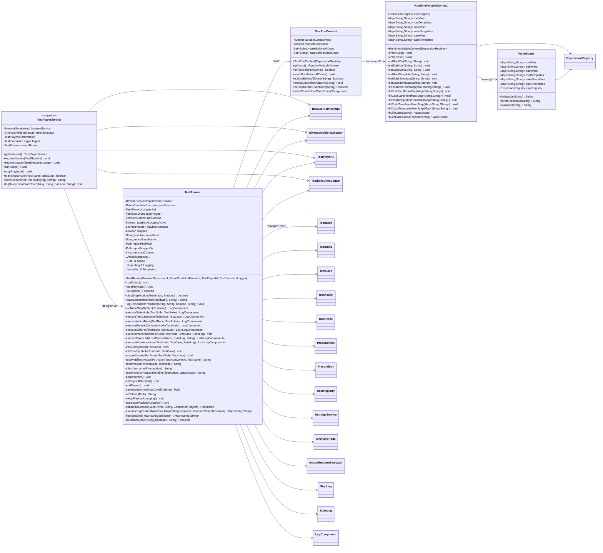

```mermaid
classDiagram
    direction LR

    class TestPlayerService {
      <<singleton>>
      -BrowserServiceImpl browserService
      -GivenConditionExecutor givenExecutor
      -TestPlayerUi drawerRef
      -TestExecutionLogger logger
      -TestRunner currentRunner
      +getInstance() TestPlayerService
      +registerDrawer(TestPlayerUi) void
      +registerLogger(TestExecutionLogger) void
      +runSuites() void
      +stopPlayback() void
      +playSingleAction(TestAction, StepLog) boolean
      +saveScreenshotFromTool(byte[], String) String
      +logScreenshotFromTool(String, String, boolean, String) void
    }

    class TestRunner {
      -BrowserServiceImpl browserService
      -GivenConditionExecutor givenExecutor
      -TestPlayerUi drawerRef
      -TestExecutionLogger logger
      -TestRunContext runContext
      -boolean playbackLoggingActive
      -List~Runnable~ playbackUnsubs
      -boolean stopped
      -String lastUsernameUsed
      -String reportBaseName
      -Path reportHtmlPath
      -Path reportImagesDir
      -int screenshotCounter

      +TestRunner(BrowserServiceImpl, GivenConditionExecutor, TestPlayerUi, TestExecutionLogger)
      +runSuites() void
      +stopPlayback() void
      +isStopped() boolean
      +playSingleAction(TestAction, StepLog) boolean
      +saveScreenshotFromTool(byte[], String) String
      +logScreenshotFromTool(String, String, boolean, String) void

      .. Ablaufsteuerung ..
      -runNodeStepByStep(TestNode) LogComponent
      -executeSuiteNode(TestNode, TestSuite) LogComponent
      -executeTestCaseNode(TestNode, TestCase) LogComponent
      -executeActionNode(TestNode, TestAction) LogComponent
      -executeGenericContainerNode(TestNode) LogComponent
      -executeChildren(TestNode, SuiteLog) List~LogComponent~
      -executePreconditionsForCase(TestNode, TestCase, SuiteLog) void
      -executeGivenList(List~Precondtion~, SuiteLog, String) List~LogComponent~
      -executeAfterAssertions(TestNode, TestCase, SuiteLog) List~LogComponent~
      -initSuiteSymbols(TestSuite) void
      -initCaseSymbols(TestNode, TestCase) void
      -ensureCaseInitForAction(TestNode, TestCase) void

      .. User & Scope ..
      -resolveEffectiveUserForAction(TestRunContext, TestAction) String
      -resolveUserForTestCase(TestNode) String
      -inferUsername(Precondtion) String
      -resolveActionValueAtRuntime(TestAction, ValueScope) String

      .. Reporting & Logging ..
      -beginReport() void
      -initReportIfNeeded() void
      -endReport() void
      -saveScreenshotBytes(byte[], String) Path
      -relToHtml(Path) String
      -setupPlaybackLogging() void
      -teardownPlaybackLogging() void
      -subscribeNetwork(WebDriver, String, Consumer~Object~) Runnable

      .. Variablen & Templates ..
      -evaluateExpressionMapNow(Map~String,String~, Map~String,Boolean~, RuntimeVariableContext) Map~String,String~
      -filterEnabled(Map~String,String~, Map~String,Boolean~) Map~String,String~
      -isEnabled(Map~String,Boolean~, String) boolean
    }

    class TestRunContext {
      -RuntimeVariableContext vars
      -boolean rootBeforeAllDone
      -Set~String~ suiteBeforeAllDone
      -Set~String~ caseBeforeChainDone

      +TestRunContext(ExpressionRegistry)
      +getVars() RuntimeVariableContext
      +isRootBeforeAllDone() boolean
      +markRootBeforeAllDone() void
      +isSuiteBeforeAllDone(String) boolean
      +markSuiteBeforeAllDone(String) void
      +isCaseBeforeChainDone(String) boolean
      +markCaseBeforeChainDone(String) void
    }

    class RuntimeVariableContext {
      -ExpressionRegistry exprRegistry
      -Map~String,String~ rootVars
      -Map~String,String~ rootTemplates
      -Map~String,String~ suiteVars
      -Map~String,String~ suiteTemplates
      -Map~String,String~ caseVars
      -Map~String,String~ caseTemplates

      +RuntimeVariableContext(ExpressionRegistry)
      +enterSuite() void
      +enterCase() void

      +setRootVar(String, String) void
      +setSuiteVar(String, String) void
      +setCaseVar(String, String) void
      +setRootTemplate(String, String) void
      +setSuiteTemplate(String, String) void
      +setCaseTemplate(String, String) void

      +fillRootVarsFromMap(Map~String,String~) void
      +fillSuiteVarsFromMap(Map~String,String~) void
      +fillCaseVarsFromMap(Map~String,String~) void
      +fillRootTemplatesFromMap(Map~String,String~) void
      +fillSuiteTemplatesFromMap(Map~String,String~) void
      +fillCaseTemplatesFromMap(Map~String,String~) void

      +buildCaseScope() ValueScope
      +buildCaseScopeForActionOnly() ValueScope
    }

    class ValueScope {
      -Map~String,String~ rootVars
      -Map~String,String~ suiteVars
      -Map~String,String~ caseVars
      -Map~String,String~ rootTemplates
      -Map~String,String~ suiteTemplates
      -Map~String,String~ caseTemplates
      -ExpressionRegistry exprRegistry

      +lookupVar(String) String
      +renderTemplate(String) String
      +evaluate(String) String
    }

    %% wichtige Kollaborateure als Platzhalter

    class BrowserServiceImpl
    class GivenConditionExecutor
    class TestPlayerUi
    class TestExecutionLogger
    class TestNode
    class TestSuite
    class TestCase
    class TestAction
    class RootNode
    class Precondition
    class Precondtion
    class UserRegistry
    class SettingsService
    class OverlayBridge
    class ActionRuntimeEvaluator
    class StepLog
    class SuiteLog
    class LogComponent

    %% Beziehungen

    TestPlayerService --> TestRunner : "delegiert an"
    TestPlayerService --> BrowserServiceImpl
    TestPlayerService --> GivenConditionExecutor
    TestPlayerService --> TestPlayerUi
    TestPlayerService --> TestExecutionLogger

    TestRunner --> TestRunContext : "hält"
    TestRunner --> BrowserServiceImpl
    TestRunner --> GivenConditionExecutor
    TestRunner --> TestPlayerUi
    TestRunner --> TestExecutionLogger

    TestRunner --> TestNode : "navigiert Tree"
    TestRunner --> TestSuite
    TestRunner --> TestCase
    TestRunner --> TestAction
    TestRunner --> RootNode
    TestRunner --> Precondition
    TestRunner --> Precondtion
    TestRunner --> UserRegistry
    TestRunner --> SettingsService
    TestRunner --> OverlayBridge
    TestRunner --> ActionRuntimeEvaluator
    TestRunner --> StepLog
    TestRunner --> SuiteLog
    TestRunner --> LogComponent

    TestRunContext --> RuntimeVariableContext : "verwendet"
    RuntimeVariableContext --> ValueScope : "erzeugt"
    RuntimeVariableContext --> ExpressionRegistry
    ValueScope --> ExpressionRegistry

```
